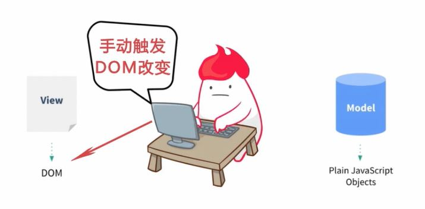
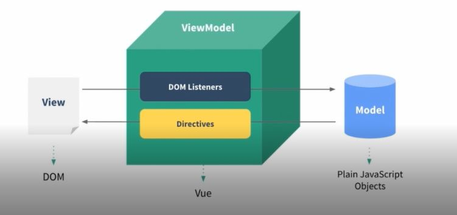
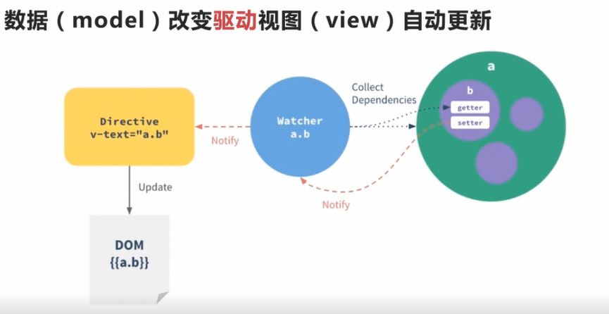
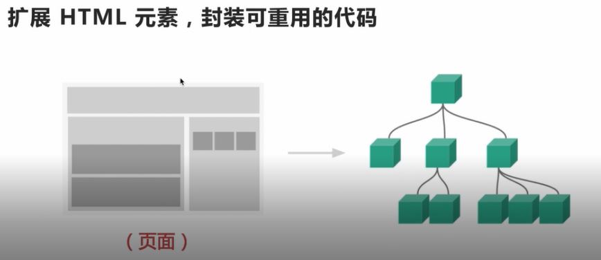

# vue-sell-app
this is a vue app project

## Project setup
```
yarn install
```

### Compiles and hot-reloads for development
```
yarn run serve
```

### Compiles and minifies for production
```
yarn run build
```

### Run your tests
```
yarn run test
```

### Lints and fixes files
```
yarn run lint
```

### Customize configuration
See [Configuration Reference](https://cli.vuejs.org/config/).

## 学习内容
>* `Vue.js框架介绍`
>* `Vue-cli脚手架`     搭建基本框架代码
>* `vue-router `      官方插件管理路由
>* `vue-resource `    Ajax通信
>* `Webpack `         构建工具
>* `es6 + eslint`     eslint: es6代码风格检查工具
>* `工程化 组件化 模块化 `
>* `移动端常用开发技巧` flex弹性布局， css stickyfooter, 交互设计

## 前端开发趋势
>* 旧浏览器逐渐淘汰，移动端需求增加
>* 前端交互越来越多，功能越来越复杂
>* 框架从传统后台`MVC`向`REST API+ `前端`mv*`迁移
传统的后台mvc模式，前后端发生数据交互时，会刷新整个页面，这种用户体验很差，因此我们通过Ajax的方式与后端REST API做通讯，异步刷新页面的某个区块，来优化和提升体验，同时将MVC拿到前端来做
## MV*
### MVC
>View 持有了Controller，把事件传递给Controller，Controller 由此去触发Model层的事件，Model更新完数据（网络或者本地数据）之后触发View的更新事件


### MVP
>MVP其实是MVC的封装和演化，Controller被拆分，只用它处理View的点击事件，数据绑定，等处理，而View被拆分，更加专注于视图的更新，只做跟视图相关的操作，而Presenter被独立出来，用于沟通View和Model之间的联系，Model不能直接作用于View 的更新，只能通过Presenter来通知View进行视图的刷新，比如showLoading（），showEmpty()，showToast（）等等，这样View就完全被独立出来了，只是被动接受Presenter的命令，这样避免了View 有过多的逻辑处理，更加简单。Presenter持有了Model。Model 只用于处理跟数据获取相关的逻辑。


### MVVM
> MVVM 又称状态机制，View和ViewModel 是进行绑定的，改变ViewModel 就会直接作用到View视图上，而View 会把事件传递给ViewModel,ViewModel去对Model进行操作并接受更新。


1. 针对具有复杂交互逻辑的前端应用
2. 提供基础的架构抽象
3. 通过Ajax数据持久化，保证前端用户体验，特别在移动端应用，刷新页面的代价太昂贵，会重新加载很多资源，虽然有些资源会被缓存，但是页面DOM，js,css 都会被浏览器重新解析一遍，因此移动端页面通常会做成`spa（single page web application，SPA）`单页应用.
Angular, React, Vue都是MVVM框架

## Vue简介
* 轻量级MVVM框架
* 数据驱动 + 组件化的前端开发 数据驱动和组件化是vue的核心思想
* Github社区活跃，完善

## 对比 Angular React
* Vue.js 更轻量，gzip后大小只有20k+
* Vue.js 更易上手，学习曲线平稳
* 吸取两家之长，借鉴了angular的指令和react的组件化
> vue语法中，借鉴了angular的指令。v-show,v-hide对应angular中的ng-show,ng-hide. vue的组件化思想，把一个页面抽成一个组件树，组件都会有完整的生命周期。
vue也有一些独有的特性，比如计算属性。

## vue的核心思想
### 1.  数据驱动

> 如果没有MVVM框架，数据和视图的交互：通过ajax从后端获取数据，为了让视图改变，来手动触发改变DOM。有时通过前端交互改变数据，为了让视图改变，仍然需要手动触发改变DOM。这些改变DOM的过程繁琐而且易出错。


> 使用VUEJS后，省去了手动操作DOM的步骤，在VUEJS里只需要改变数据，vuejs通过Directives指令对DOM做一层封装，当数据发生变化，会通知指令修改对应的DOM
> 数据驱动DOM变化，DOM是数据的一种自然映射
> VUEJS还会对操作进行监听，当我们修改视图时，vuejs监听到这些变化，从而改变数据，这样就形成了数据的双向绑定

**数据响应原理:**
* 数据（model）改变驱动视图（view）自动更新


> 有一份数据a.b, 在一个vue对象实例化的过程中，会给a.b这份数据通过ES5的object.defineproperty属性添加getter和setter,同时，vuejs会对模板做编译，解析生成一个指令对象，这里就是一个v-text指令。每个指令对象都会关联一个watcher,当我们对指令对应的表达式a.b做求值时就会触发它的getter,这里把依赖收集到watcher里面，当我们改变a.b的值时，我们会触发它的setter,会通知到对应关联的watcher,然后watcher就会再次对a.b求值，计算对比新旧值，当发现值改变了，watcher又会通知到指令，调用指令的update方法，由于指令是对DOM的封装，所以会调用原生DOM方法去更新视图。这样就完成了数据改变到视图更新的过程。
### 2. 组件化
> 组件化的目的是扩展HTML元素，封装可重用的代码


左侧是我们的页面，被拆分成一个个小的区块，每个区块对应一个组件，组件可以嵌套，最终组合形成一个完整的页面。在vuejs中，每个组件对应一个vue model,最终我们生成vue model的树，它和我们的DOM树都是一一对应的关系

**组件设计原则**

* 页面上每个独立的可视/可交互区域视为一个组件
* 每个组件对应一个工程目录，组件所需要的各种资源在这个目录下就近维护
> 就近维护原则体现了前端工程化思想，它为前端开发提供了很好的xx策略，每个开发者都将清楚的知道自己所开发维护的功能单元，代码必然存在对应的组件目录中，在目录下就可以找到功能单元内所有的内部逻辑，样式也好，js也好，都在。在vuejs中，可以通过.vue文件把组件依赖的模板，js,css都写在一个文件中，这把组件化的就近维护思想发挥到了极致
* 页面不过是组件的容器，组件可以嵌套自由组合形成完整的页面
> 在我们本次项目开发中，我们就会把页面拆分成一个个组件，我们会通过实战的方式加深对组件化的认识。
## vue-cli
vue-cli 是vue的脚手架工具，帮助我们写好vue.js基础代码的工具。能帮我们搞定`目录结构`，`本地调试`，`代码部署`，`热加载`，`单元测试`等工作。

## 项目文件介绍
* src 文件夹： 存放项目源码

## 需求分析
SPA 单页
> src 文件夹下新建common文件夹，用来存放 公共模块资源。
> stylus 是css预处理器，和less,sass差不多。

## 项目字体制作
> IconMoon 导入自己的icon文件，可以生成图标字体
## 项目骨架
> 移动端Flex布局
> 移动端设计都是按像素的两倍来设计`dpi=2来设计`，设备像素，物理像素，
> vue的css会自动生成一些浏览器的兼容性写法，因为vue-loader依赖postcss插件,postcss会自动搞定css兼容问题。
> 选项卡切换时，我们通过第三方插件vue-router来实现。
> css书写规范： 写css时布局样式写在前面（postion, display），宽高（重绘）的放在后面，最后写字体之类可被继承的属性，重绘不影响重排。
> 手机端的dbi概念，iphone6下物理像素是设备像素的两倍，对于边框的1像素如何实现。通过伪类：after
media query对移动端设备做缩放，这样就可以达到一像素的效果
> mixin是一个css预处理器，提供一个特殊的方法。可以通过定义一个函数并调用来实现通用
> @import是stylus的引入语法(引入css的通用语法)，可以引入任意路径下的stylus（css）文件
> ajax 请求。vuejs社区有一个比较火的第三方插件vue-resource,用来处理一些前后端请求数据交互。我们规定按errno来判断返回数据是否正常，errno为0时，表示返回数据正常
> 将静态资源放到当前目录下的vue组件下