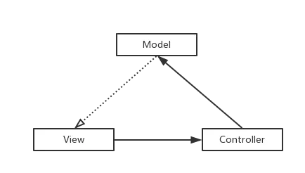
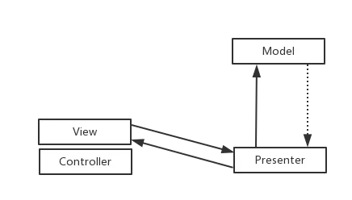
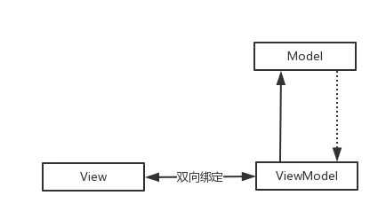

# vue-webapp
this is a vue app project
## 学习内容
>* `Vue.js框架介绍`
>* `Vue-cli脚手架`     搭建基本框架代码
>* `vue-router `      官方插件管理路由
>* `vue-resource `    Ajax通信
>* `Webpack `         构建工具
>* `es6 + eslint`     eslint: es6代码风格检查工具
>* `工程化 组件化 模块化 `
>* `移动端常用开发技巧` flex弹性布局， css stickyfooter, 交互设计

## 前端开发趋势
>* 旧浏览器逐渐淘汰，移动端需求增加
>* 前端交互越来越多，功能越来越复杂
>* 框架从传统后台`MVC`向`REST API+ `前端`mv*`迁移
传统的后台mvc模式，前后端发生数据交互时，会刷新整个页面，这种用户体验很差，因此我们通过Ajax的方式与后端REST API做通讯，异步刷新页面的某个区块，来优化和提升体验，同时将MVC拿到前端来做
## MV*
### MVC
>* View 持有了Controller，把事件传递给Controller，Controller 由此去触发Model层的事件，Model更新完数据（网络或者本地数据）之后触发View的更新事件

### MVP
>* MVP其实是MVC的封装和演化，Controller被拆分，只用它处理View的点击事件，数据绑定，等处理，而View被拆分，更加专注于视图的更新，只做跟视图相关的操作，而Presenter被独立出来，用于沟通View和Model之间的联系，Model不能直接作用于View 的更新，只能通过Presenter来通知View进行视图的刷新，比如showLoading（），showEmpty()，showToast（）等等，这样View就完全被独立出来了，只是被动接受Presenter的命令，这样避免了View 有过多的逻辑处理，更加简单。Presenter持有了Model。Model 只用于处理跟数据获取相关的逻辑。

### MVVM
>* MVVM 又称状态机制，View和ViewModel 是进行绑定的，改变ViewModel 就会直接作用到View视图上，而View 会把事件传递给ViewModel,ViewModel去对Model进行操作并接受更新。

1. 针对具有复杂交互逻辑的前端应用
2. 提供基础的架构抽象
3. 通过Ajax数据持久化，保证前端用户体验，特别在移动端应用，刷新页面的代价太昂贵，会重新加载很多资源，虽然有些资源会被缓存，但是页面DOM，js,css 都会被浏览器重新解析一遍，因此移动端页面通常会做成`spa（single page web application，SPA）`单页应用.
Angular, React, Vue都是MVVM框架

## Vue简介
* 轻量级MVVM框架
* 数据驱动 + 组件化的前端开发 数据驱动和组件化是vue的核心思想
* Github社区活跃，完善

## 对比 Angular React
* Vue.js 更轻量，gzip后大小只有20k+
* Vue.js 更易上手，学习曲线平稳